## E-mail: felipekian@yahoo.com.br

# PROJETO SISTEMA BALADA

Projeto desenvolvido para a disciplina de Banco de Dados I seguindo o arquivo de requisitos do sistema disponibilizado pelo professor.

---

## OBJETIVO

O objetivo deste trabalho foi colocar em prática os conceitos de SQL e Modelagem de banco de dados usando DER - Diagrama de Entidade Relacionamento.

---

## RECURSOS UTILIZADOS

* LINGUAGEM DE PROGRAMAÇÃO: JAVA 8.
* BANCO DE DADOS: MySQL ou MARIA_DB.

---

## RESUMO DO PROJETO

O sistema deveria poder cadastrar clientes, funcionarios, mesas temáticas, mantimentos, pratos, gerenciar mesas, estoque,...

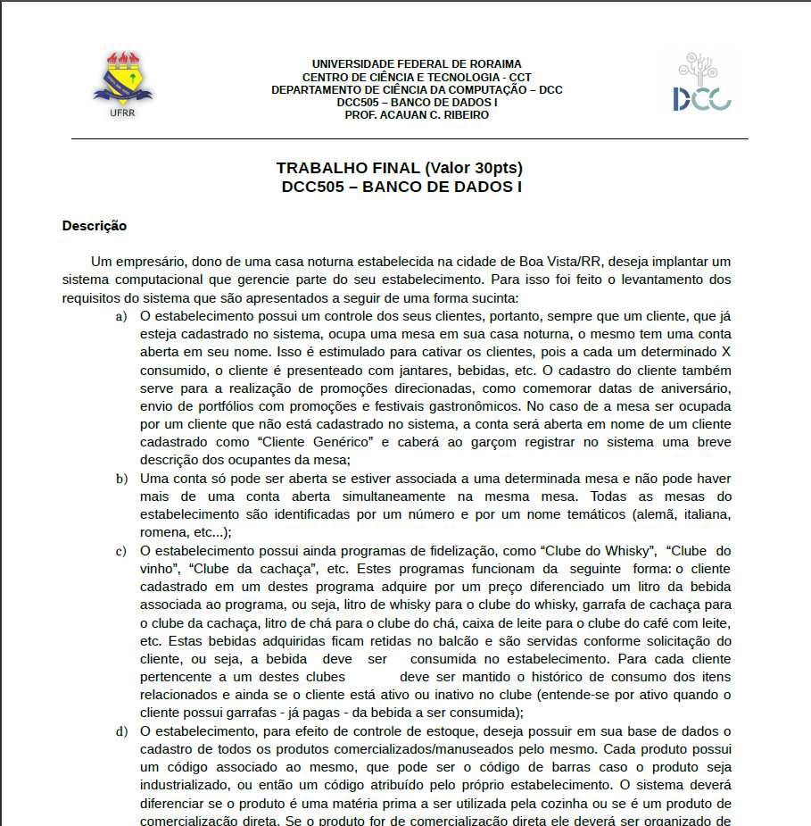
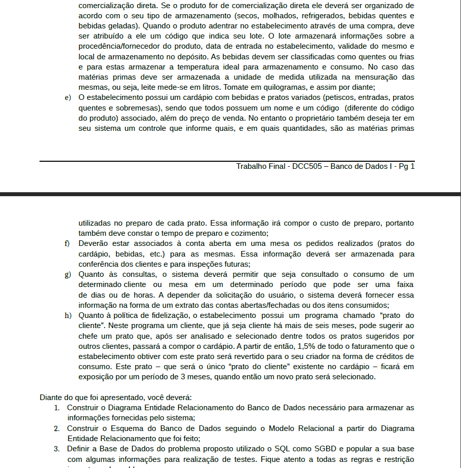
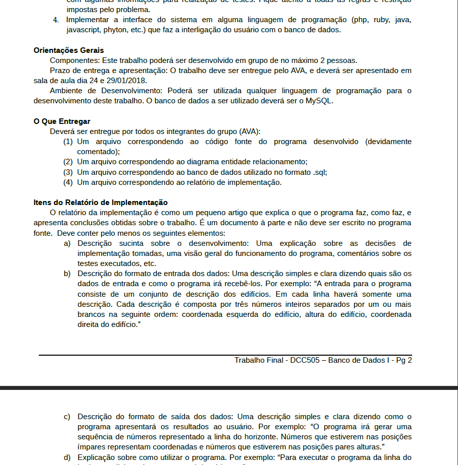
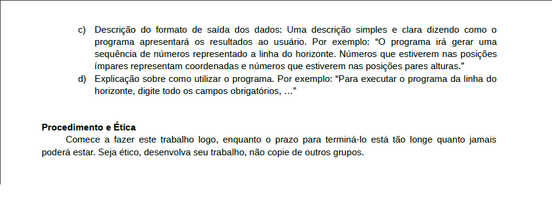

---

# IMAGENS DO SISTEMA

 

# Tela de login do sistema
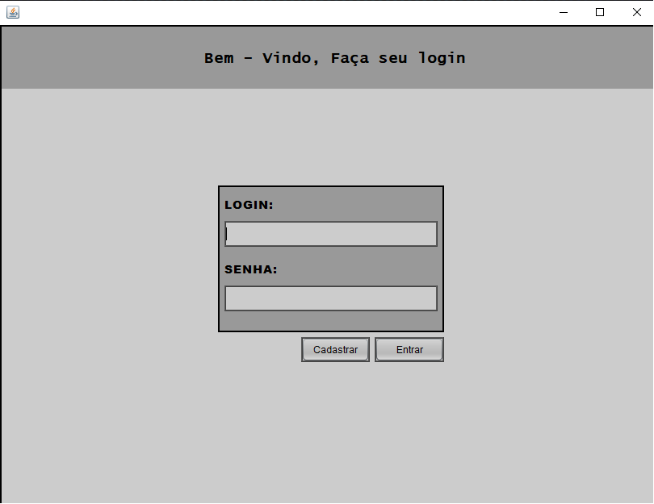

 

# Tela para cadastrar no sistema
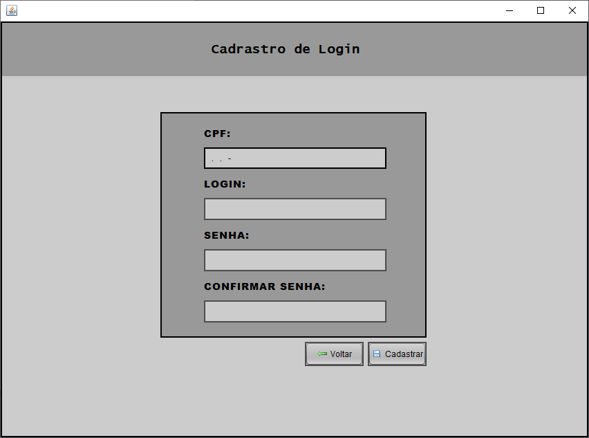

 

# Tela para cadastrar novos clientes
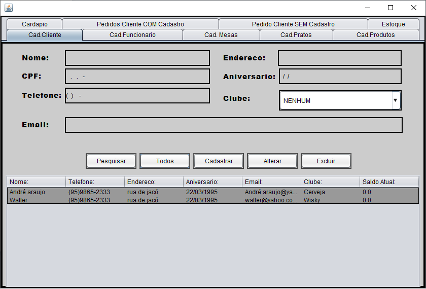

 

# Tela para cadastrar novos funcionários
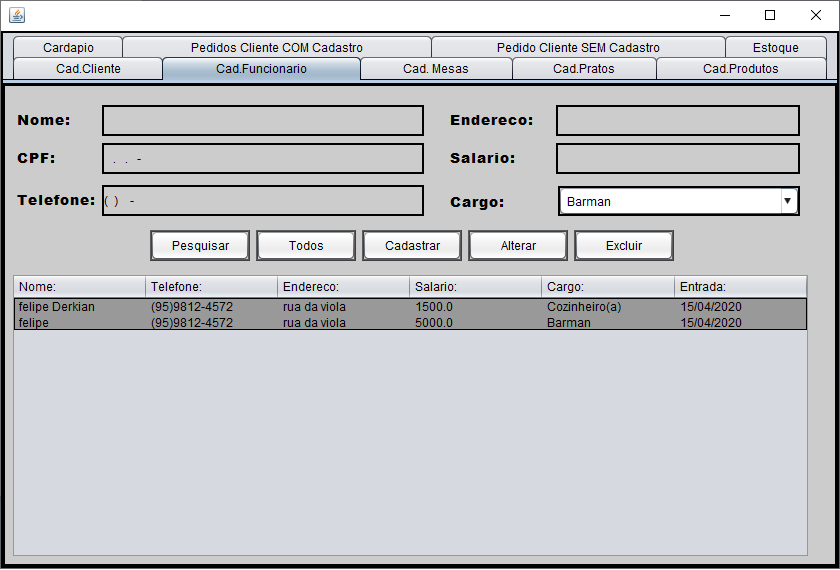

 

# Tela para cadastrar novos pratos para o cardápio
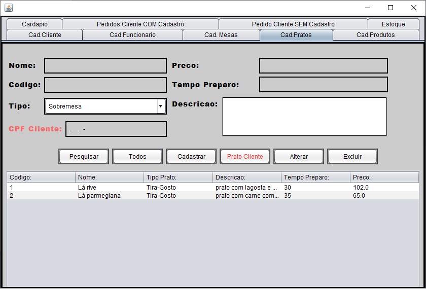

 

# Tela para cadastrar novas bebidas e matimentos
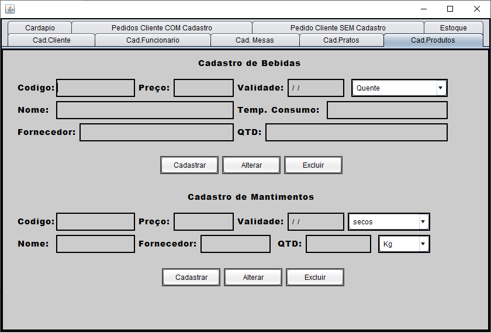

 

# Tela para listagem e cadastro de mesas temáticas
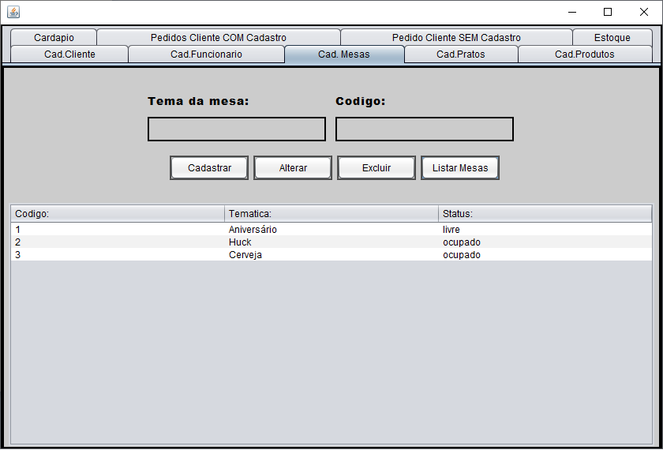

 

# Tela para controle de estoque 
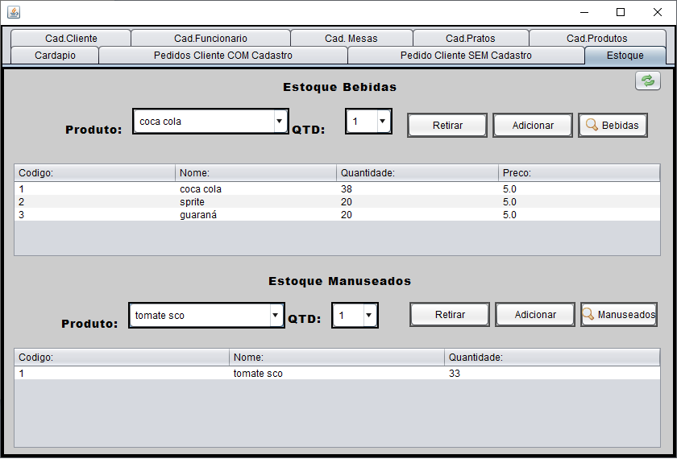

 

# Tela que mostram as opções do cardápio do estabelecimento
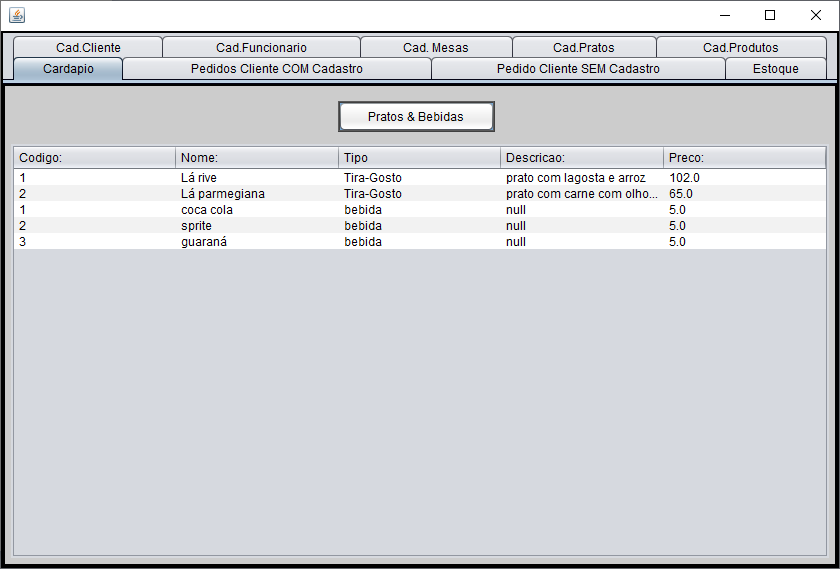

 

# Tela para gerenciamento de pedidos
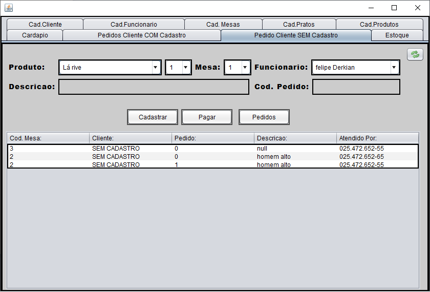

# ESPERO QUE TENHA GOSTADO, OBRIGADO PELA VISITA!

## E-mail: felipekian@yahoo.com.br
